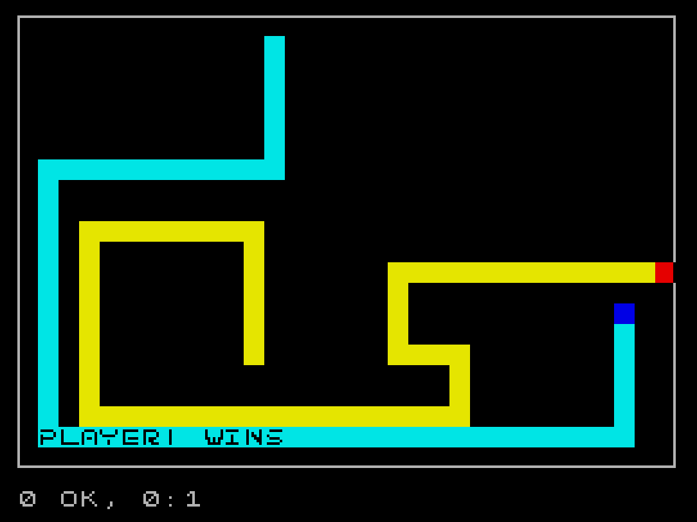
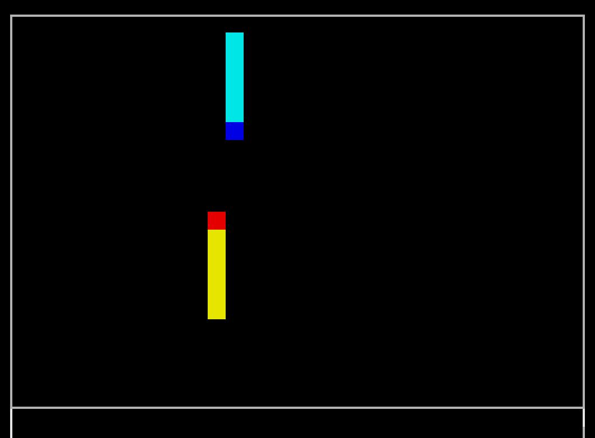
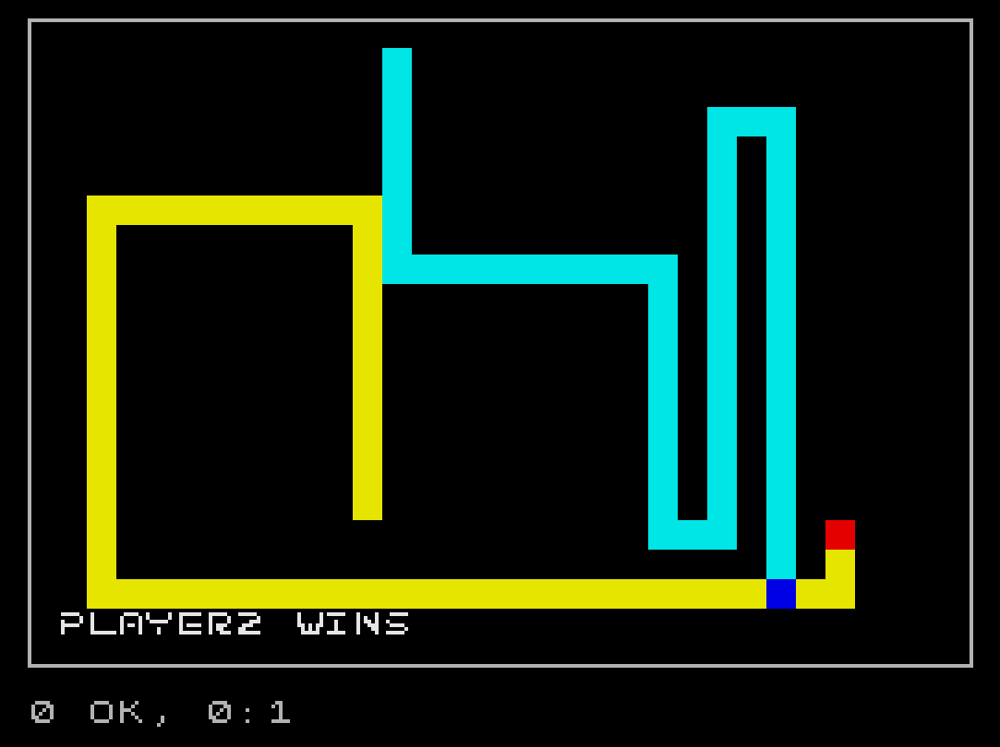
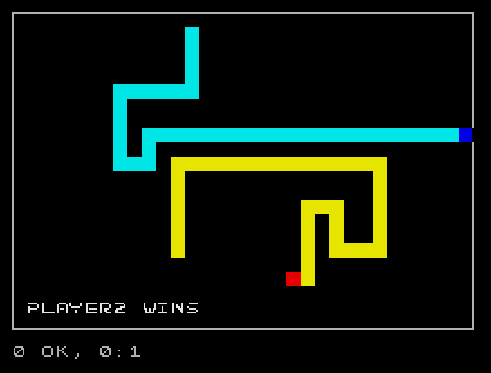

# RAINBOW TRON - a version of the classic videogame on the ZX Spectrum

# About

This is a version of the classic "Tron" videogame, programmed in Z80 assembly for the ZX Spectrum 48K. It can be run in an emulator, or on the actual device.
The program was first written and assembled in 2022, then disassembled and documented in 2024.

- See [Usage](#usage) for instructions on how to use this repository.
- See [Examples](#examples) for example media of the game.
- See [Backstory](#backstory) if you want to read more about the story behind this project.

# Examples

<table>
    <tbody>
        <tr>
            <td align="center">
                
            </td>
            <td align="center">
                
            </td align="center">
        </tr>
        <tr>
            <td align="center">
                
            </td>
            <td align="center">
                
            </td align="center">
        </tr>
    </tbody>
<table>

# Usage

### Prerequisites

Before running the program, make sure you have the following:

- A working ZX Spectrum 48K emulator (ex. fuse)
- (optional) a working ZX Spectrum 48K, connected to a color screen

### Starting the game

To play the game, you can load the provided `tron.tap` file into the emulator.
You can also load the binary file if your emulator supports that.
Depending on the emulator you might have to start the game yourself. This can be done with the following commands:

```
(J)LOAD (CTRL+P)"" (CTRL+SHIFT+I)CODE  --> this loads the program into the memory from the tape

(T)RANDOMIZE (CTRL+SHIFT+L)USR 32768 --> this will run the program
```

NOTE: Some emulators automatically load the program into memory, so running the second command could be enough; Inside the brackets is what you are supposed to press on the keyboard to write the command.

### Keybindings

- #### Player1 (Blue)
  - W -> up
  - A -> left
  - S -> down
  - D -> right
- #### Player2 (Yellow)
  - I -> up
  - J -> left
  - K -> down
  - L -> right

# Assembling

If you want to assemble it for yourself, I recommend using pasmo assembler. That's the one that worked best for me.

It should be pretty straight forward, after installing pasmo assembler you just execute this command in the root directory:

`pasmo ./tron.asm ./tron.bin`

And if you want a .tap (tape) file:

`pasmo --tap ./tron.asm ./tron.tap`
